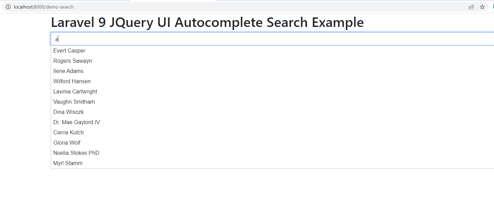

# laravel9_autocomplete_search_using_query_ui
## 1: Install Laravel 9
```Dockerfile
composer create-project laravel/laravel laravel9_autocomplete_search_using_query_ui
```
## 2: Add Dummy Users
```Dockerfile
php artisan migrate
```
- Chạy 
```Dockerfile
php artisan tinker
User::factory()->count(20)->create()
```
## 3: Create Controller
-  Vào app/Http/Controllers/SearchController.php
```Dockerfile
<?php
  
namespace App\Http\Controllers;
 
use Illuminate\Http\Request;
use App\Models\User;
  
class SearchController extends Controller
{
    /**
     * Display a listing of the resource.
     *
     * @return \Illuminate\Http\Response
     */
    public function index()
    {
        return view('searchDemo');
    }
    
    /**
     * Show the form for creating a new resource.
     *
     * @return \Illuminate\Http\Response
     */
    public function autocomplete(Request $request)
    {
        $data = User::select("name as value", "id")
                    ->where('name', 'LIKE', '%'. $request->get('search'). '%')
                    ->get();
    
        return response()->json($data);
    }
}
```
## 4: Create Routes
- routes/web.php
```Dockerfile
<?php
  
use Illuminate\Support\Facades\Route;
  
use App\Http\Controllers\SearchController;
  
/* 
|--------------------------------------------------------------------------
| Web Routes
|--------------------------------------------------------------------------
|
| Here is where you can register web routes for your application. These
| routes are loaded by the RouteServiceProvider within a group which
| contains the "web" middleware group. Now create something great!
|
*/
  
Route::controller(SearchController::class)->group(function(){
    Route::get('demo-search', 'index');
    Route::get('autocomplete', 'autocomplete')->name('autocomplete');
});
```
## 5: Create View File
- Vào resources/views/searchDemo.blade.php
```Dockerfile
<!DOCTYPE html>
<html>
<head>
    <title>Laravel 9 JQuery UI Autocomplete Search Example - ItSolutionStuff.com</title>
    <link href="https://cdn.jsdelivr.net/npm/bootstrap@5.0.2/dist/css/bootstrap.min.css" rel="stylesheet">
    <link rel="stylesheet" href="https://cdnjs.cloudflare.com/ajax/libs/jqueryui/1.12.1/jquery-ui.min.css" />
    <script src="https://cdnjs.cloudflare.com/ajax/libs/jquery/3.6.0/jquery.min.js"></script>
    <script src="https://cdnjs.cloudflare.com/ajax/libs/jqueryui/1.12.1/jquery-ui.min.js"></script>
</head>
<body>
     
<div class="container">
    <h1>Laravel 9 JQuery UI Autocomplete Search Example - ItSolutionStuff.com</h1>   
    <input class="typeahead form-control" id="search" type="text">
</div>
     
<script type="text/javascript">
    var path = "{{ route('autocomplete') }}";
  
    $( "#search" ).autocomplete({
        source: function( request, response ) {
          $.ajax({
            url: path,
            type: 'GET',
            dataType: "json",
            data: {
               search: request.term
            },
            success: function( data ) {
               response( data );
            }
          });
        },
        select: function (event, ui) {
           $('#search').val(ui.item.label);
           console.log(ui.item); 
           return false;
        }
      });
  
</script>
     
</body>
</html>
```
## 6: Run Laravel App:
```Dockerfile
php artisan serve
```
- Vào http://localhost:8000/demo-search


